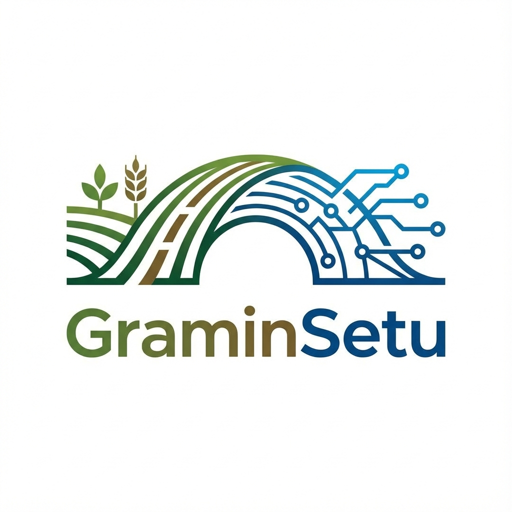

# GraminSetu - Integrated Rural Development Platform 🌾

GraminSetu ("Rural Bridge") is a comprehensive digital platform designed to empower rural India by bridging the gap between technology and agriculture. It provides farmers with AI-driven insights, housing scheme management, and GIS-based land monitoring.



## 🚀 Features

### 🌱 Smart Agriculture
- **Crop Recommendation:** AI-based crop suggestions based on soil type (Alluvial, Black, Red, etc.).
- **Fertilizer Planner:** Customized fertilizer schedules for optimal yield.
- **Disease Detection:** (Planned) Image-based crop disease diagnosis.

### 🏡 Housing MIS (PMAY-G)
- **Application Tracking:** Seamless management of housing applications.
- **Stage Monitoring:** Track construction progress (Foundation, Plinth, Roof, Completed).
- **Geo-Tagging:** GIS integration for verifying construction sites.

### 🗺️ GIS Platform
- **Land Mapping:** Interactive map interface for visualizing land parcels.
- **Soil Layering:** View soil composition and land usage data.
- **District Analytics:** Aggregated data for administrative planning.

## 🛠️ Tech Stack

### Frontend
- **Framework:** React (Vite)
- **UI Component Library:** shadcn/ui & Tailwind CSS
- **Maps:** Leaflet & React-Leaflet
- **State Management:** React Context / Hooks

### Backend
- **Runtime:** Node.js
- **Framework:** Express.js
- **Database:** MongoDB Atlas (Cloud)
- **Mail Service:** Nodemailer (Gmail integration)

## 📂 Project Structure

```bash
GraminSetu/
├── Frontend/           # React Client Application
│   ├── src/
│   ├── public/
│   └── ...
└── Backend/            # Node.js API Server
    ├── models/
    ├── routes/
    └── ...
```

## 🚀 Getting Started

### Prerequisites
- Node.js (v16 or higher)
- MongoDB Connection String
- Gmail App Password (for email features)

### Installation

1. **Clone the repository**
   ```bash
   git clone https://github.com/your-username/graminsetu.git
   cd graminsetu
   ```

2. **Setup Backend**
   ```bash
   cd Backend
   npm install
   # Create a .env file with your credentials (see .env.example if available)
   npm run dev
   ```

3. **Setup Frontend**
   ```bash
   cd ../Frontend
   npm install
   npm run dev
   ```

## 🤝 Contribution
Contributions are welcome! Please open an issue or submit a pull request for any improvements.

## 📜 License
This project is licensed under the MIT License.
